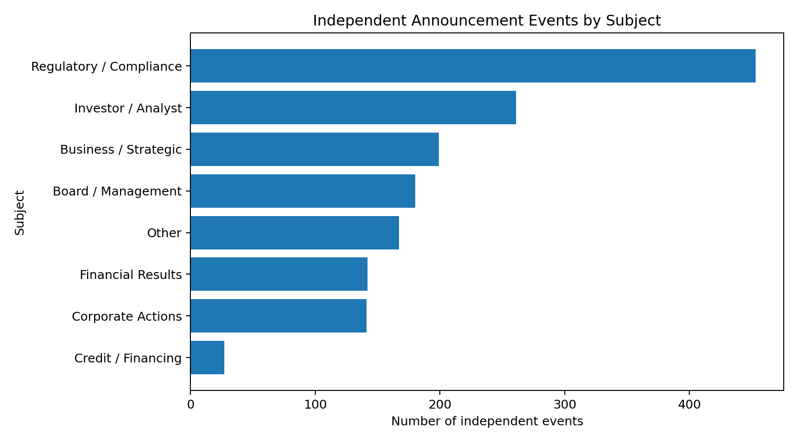
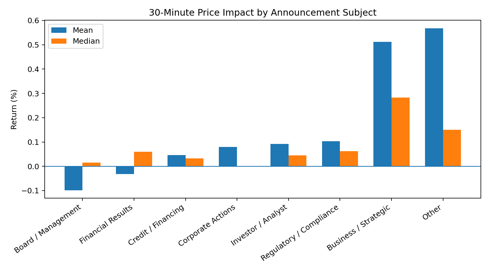
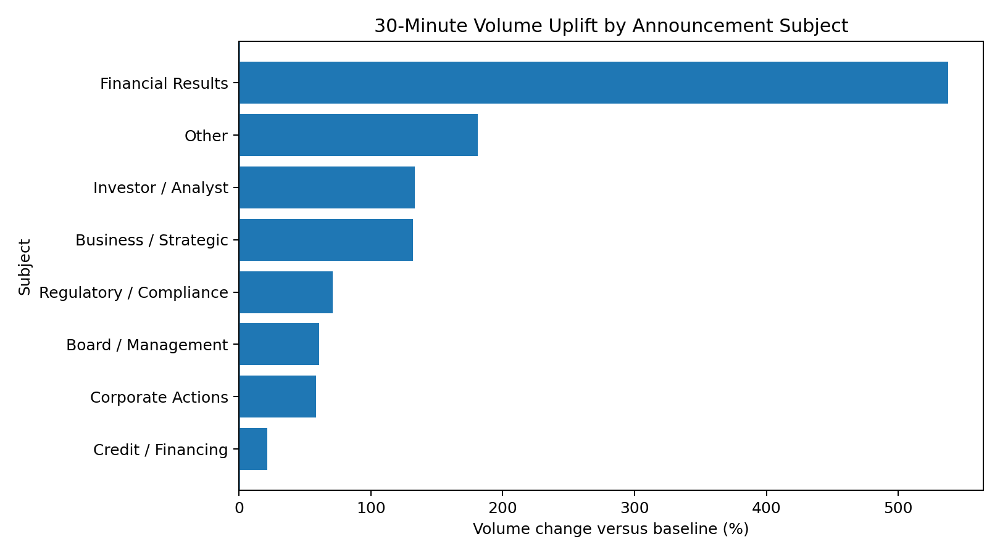
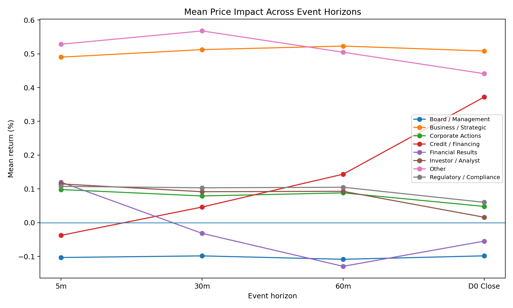
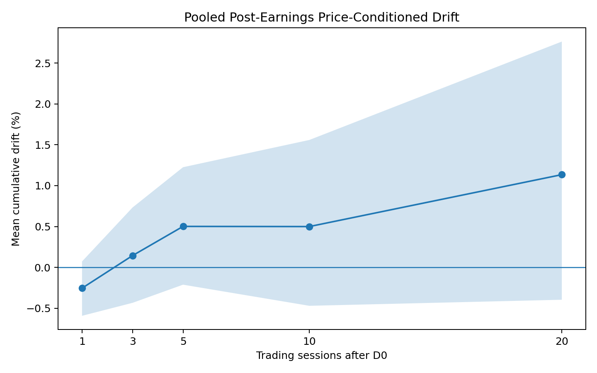
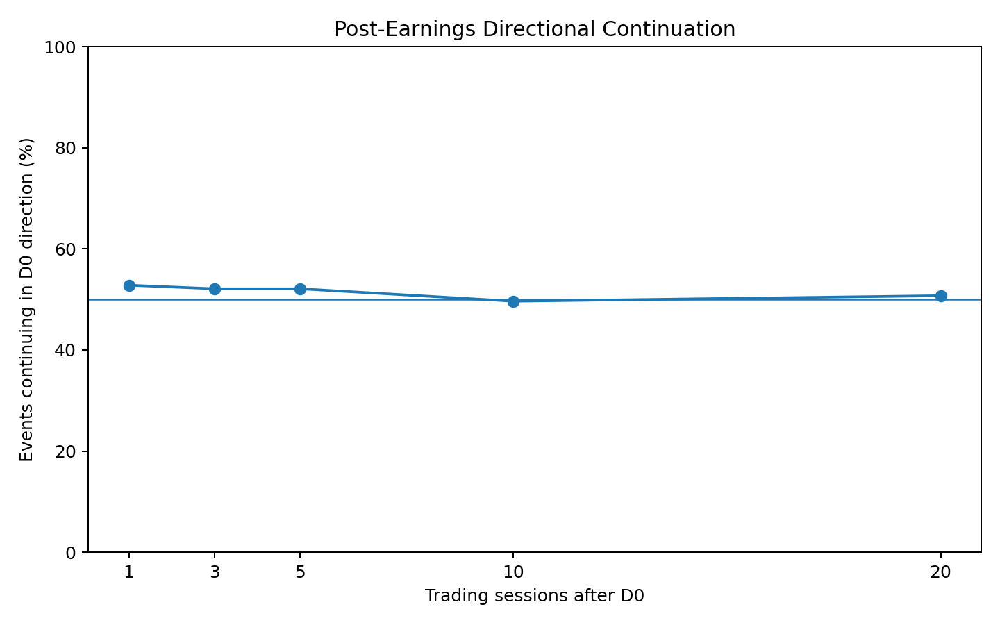

# Indo Thai Quantitative Data Analyst Intern – Take-Home Assessment

## 1. Objective

This analysis studies how BSE corporate announcements are associated with short-term stock-price and trading-volume movements and with post-earnings price drift for five supplied stocks.

## 2. Data and Validation

The analysis started with **2,530 announcements**. After the same-stock 30-minute clustering rule, there were **2,096 event clusters**. After consolidating multiple clusters that mapped to the same stock and effective market bar, the final sample contained **1,673 independent market events**.

### Validation Summary

| symbol   |   rows |   duplicate_rows |   duplicate_timestamps |   invalid_timestamps |   missing_values_total |   invalid_ohlc_rows |   zero_volume_rows |   sessions | earliest_timestamp   | latest_timestamp    |   nonstandard_sessions |   modal_session_length |
|:---------|-------:|-----------------:|-----------------------:|---------------------:|-----------------------:|--------------------:|-------------------:|-----------:|:---------------------|:--------------------|-----------------------:|-----------------------:|
| RELIANCE | 277510 |                0 |                      0 |                    0 |                   5420 |                   0 |                190 |        744 | 2023-08-21 09:15:00  | 2026-08-19 15:29:00 |                      6 |                    375 |
| HDFCBANK | 277510 |                0 |                      0 |                    0 |                   5420 |                   1 |                187 |        744 | 2023-08-21 09:15:00  | 2026-08-19 15:29:00 |                      6 |                    375 |
| NYKAA    | 277508 |                0 |                      0 |                    0 |                   6166 |                   0 |                191 |        744 | 2023-08-21 09:15:00  | 2026-08-19 15:29:00 |                      7 |                    375 |
| HAL      | 277510 |                0 |                      0 |                    0 |                   5420 |                   1 |                187 |        744 | 2023-08-21 09:15:00  | 2026-08-19 15:29:00 |                      6 |                    375 |
| RVNL     | 277509 |                0 |                      0 |                    0 |                   5418 |                   0 |                191 |        744 | 2023-08-21 09:15:00  | 2026-08-19 15:29:00 |                      6 |                    375 |

## 3. Timestamp Alignment

A valid `DissemDT` was used as the primary announcement timestamp, with `DT_TM` used as the fallback when required. Each announcement was aligned to the first complete one-minute bar at or after dissemination. Pre-open, after-hours, weekends, holidays and non-standard sessions were handled using the observed trading-session timestamps.

## 4. Event Clustering and Consolidation

Announcements for the same stock separated by **30 minutes or less** were grouped into one initial event cluster. After market alignment, multiple clusters mapping to the same stock and effective one-minute bar were consolidated to avoid counting the same market reaction multiple times.

## 5. Subject Taxonomy

Announcements were classified using a transparent rule-based taxonomy with eight subject groups: Financial Results, Corporate Actions, Business / Strategic, Board / Management, Investor / Analyst, Credit / Financing, Regulatory / Compliance and Other.

## 6. Price and Volume Impact

For in-session announcements, short-window returns start from the effective event bar open. For events that became tradable in a later session, the previous regular-session close was used so that the overnight gap was included. Price impact was measured at 5, 30 and 60 minutes, through the session close, and at D+1, D+5, D+10 and D+20. Volume was compared with a rolling historical baseline.

## 7. Statistical Analysis

Mean, median and standard deviation were calculated for each subject and metric. Bootstrap 95% confidence intervals were used to represent uncertainty. A Kruskal-Wallis test was used to compare 30-minute return distributions across announcement subjects.

Kruskal-Wallis statistic: **23.730**

Kruskal-Wallis p-value: **0.00127062**

## 8. Strong-Impact Events

A strong announcement impact was defined as an absolute 30-minute return in the top 5% of the final market-event sample. The resulting threshold was **2.906%**, with **82** events classified as strong-impact events.

## 9. Post-Earnings Announcement Drift

Financial Results events were used for a price-conditioned post-earnings drift analysis. The sign of the D0 return defined the initial direction, and subsequent movement was measured at D+1, D+3, D+5, D+10 and D+20. Because analyst expectations and earnings-surprise data were not supplied, the analysis is described as price-conditioned PEAD rather than surprise-based PEAD.

### Pooled PEAD Summary

| scope   | stock   |   horizon_sessions |   n |   mean_drift_pct |   median_drift_pct |   ci95_low |   ci95_high |   continuation_pct |   continuation_ci95_low_pct |   continuation_ci95_high_pct |
|:--------|:--------|-------------------:|----:|-----------------:|-------------------:|-----------:|------------:|-------------------:|----------------------------:|-----------------------------:|
| pooled  | ALL     |                  1 | 142 |        -0.254738 |         -0.392267  |  -0.592797 |   0.0725334 |            52.8169 |                     44.6403 |                      60.8451 |
| pooled  | ALL     |                  3 | 142 |         0.144256 |         -0.0322098 |  -0.433982 |   0.732778  |            52.1127 |                     43.9491 |                      60.1649 |
| pooled  | ALL     |                  5 | 142 |         0.50136  |          0.310771  |  -0.211772 |   1.22586   |            52.1127 |                     43.9491 |                      60.1649 |
| pooled  | ALL     |                 10 | 141 |         0.499513 |         -0.219381  |  -0.470248 |   1.55927   |            49.6454 |                     41.5121 |                      57.7975 |
| pooled  | ALL     |                 20 | 136 |         1.13497  |         -0.466769  |  -0.396124 |   2.76371   |            50.7353 |                     42.4288 |                      59.0014 |

## 10. Limitations

- The analysis covers only five supplied stocks and should not be generalized to the broader market without additional evidence.

- The 30-minute announcement-clustering threshold is a modelling assumption.

- Multiple clusters mapping to the same effective market bar were consolidated to reduce double-counting of the same price reaction.

- Analyst expectations and earnings-surprise measures were not available, so the PEAD analysis is price-conditioned.

- The analysis is observational and does not establish causality.

- Some events may have incomplete future windows because the supplied dataset ends before the required horizon.

## 11. Reproducibility

The complete analysis is implemented in the supplied Jupyter Notebook. After placing the original datasets in the `data/` folder, the notebook can be run from top to bottom to regenerate the analysis outputs, figures and report. The supplied datasets should not be committed to the public GitHub repository.

## 12. Figures

